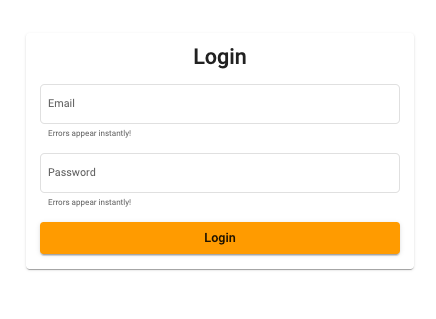
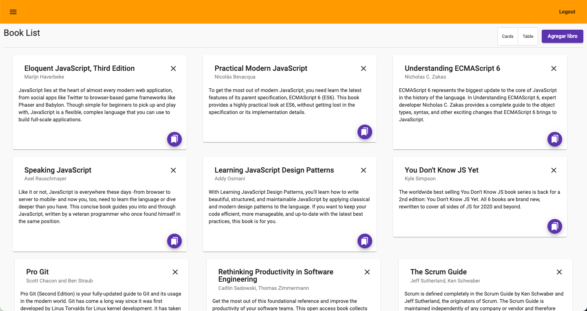
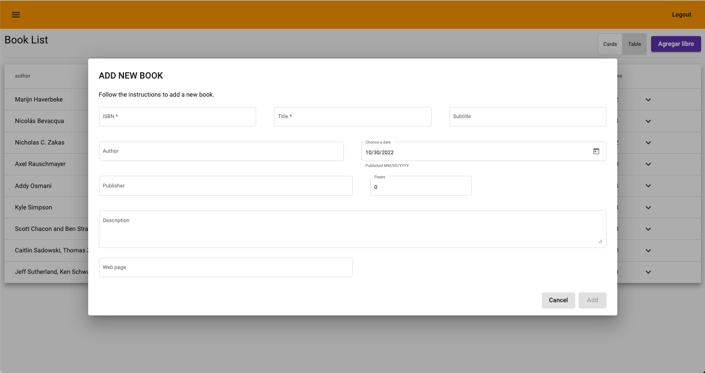
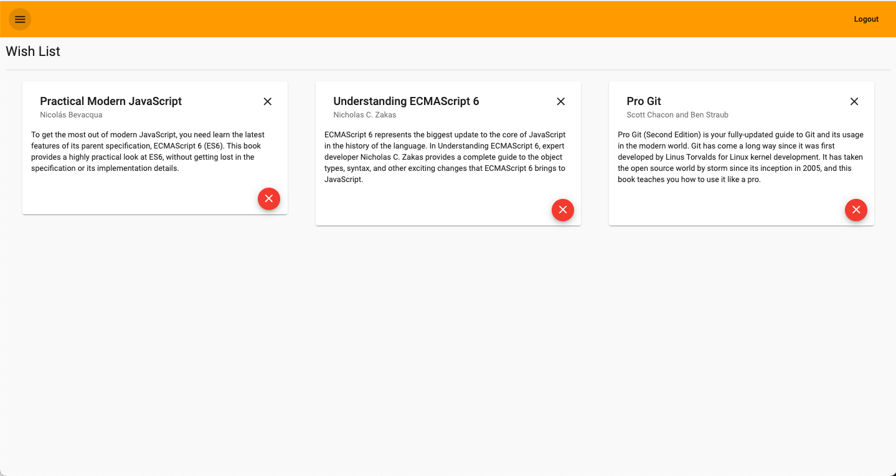
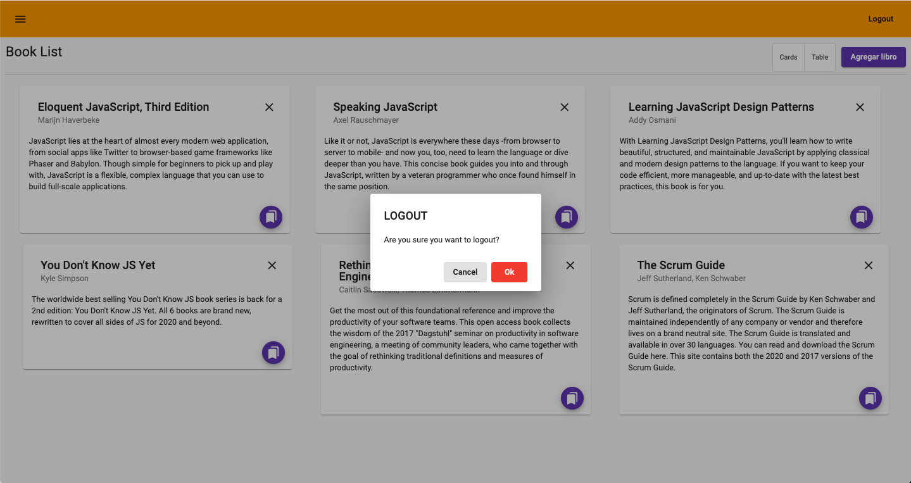

# Books

# Introduction

Books is an app that allows you to see a list of books, you can also add those books to a wish list so that you can read them later.

Books lets you view your books in two ways, with cards and in a table.

Once you have your books on your wish list and you regret about some books, you can remove books from your list.

Books also lets you add new books, help us collect more books and share them with everyone.

> **_NOTE:_**  This project is responsive, you can see it on your cell phone 😄.

> **_NOTE:_** IMPORTANT -> For the api to work you have to download this repository --> (https://github.com/eugenioroblessiller/server). This is very important since the information is not local, I wanted to demonstrate all the steps in the process of a call to an endpoint so I set up a fake server..
# Getting started

To be able to enter Books you need a username and a password, don't worry, any username with any password works.

Upon entering books, you will immediately find a list of books that we think you might be interested in, you can add those books to your wish list or remove them altogether.

At the top of the list you also have a button to add new books, share new books with everyone.

You will also find your wish list, enter and check your books, you can also remove those books.

At the end, close session at the top and come back whenever you want

# About Books

This project was generated with [Angular CLI](https://github.com/angular/angular-cli) version 14.2.6.

## Development server

Run `ng serve` for a dev server. Navigate to `http://localhost:4200/`. The application will automatically reload if you change any of the source files.

## Code scaffolding

Run `ng generate component component-name` to generate a new component. You can also use `ng generate directive|pipe|service|class|guard|interface|enum|module`.

## Build

Run `ng build` to build the project. The build artifacts will be stored in the `dist/` directory.

## Running unit tests

Run `ng test` to execute the unit tests via [Karma](https://karma-runner.github.io).

## Running end-to-end tests

Run `ng e2e` to execute the end-to-end tests via a platform of your choice. To use this command, you need to first add a package that implements end-to-end testing capabilities.

## Further help

To get more help on the Angular CLI use `ng help` or go check out the [Angular CLI Overview and Command Reference](https://angular.io/cli) page.
